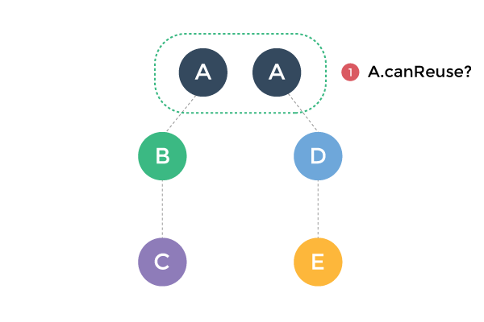
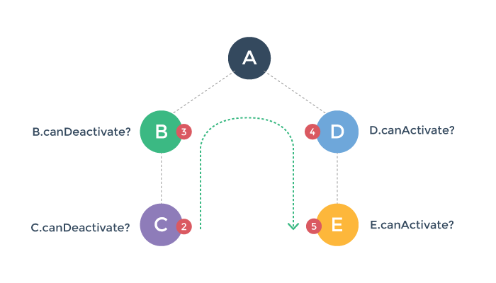

# 切换控制流水线

为更好的理解路由切换的管道，假设我们一个启用了路由的应用，此应用在路径 `/a/b/c` 时渲染了三个嵌套的 `<router-view>` :

接着，用户浏览新路径 `/a/d/e` ，导致需要更新，渲染一个新的组件树：

如何做到这些呢？这个过程包含一些我们必须要做的工作：

1. 可以重用组件 A ，因为重新渲染后，组件 A 依然保持不变。

2. 需要停用并移除组件 B 和 C 。

3. 启用并激活组件 D 和 E 。

4. 在执行步骤2和3之前，需要确保切换效果有效 - 也就是说，为保证切换中涉及的所有组件都**能**按照期望的那样被停用/激活。

使用 vue-router ，你可以控制通过实现切换钩子函数来控制这些步骤。但是在了解如何做的细节之前，我们先了解一下大局。

### 切换的各个阶段

我们可以把路由切换分为三个阶段：

1. **可重用阶段：**

  检查当前的视图结构中是否存在可以重用的组件。这是通过对比两个新的组件树，找出共用的组件，然后检查它们的可重用性（通过 `canReuse` 选项）。默认情况下， 所有组件都是可重用的，除非是定制过。

  

2. **验证阶段：**

  检查当前的组件是否能够停用以及新组件是否可以被激活。这是通过调用路由配置阶段的 `canDeactivate` 和 `canActivate` 钩子函数来判断的。

  

  注意，`canDeactivate` 按照从下至上的冒泡顺序检查，而 `canActivate` 则是从上之下。

  任何一个钩子函数都可以终止界面切换。如果在验证阶段终止了界面切换，路由器会保持当前的应用状态，恢复到前一个路径。

3. **激活阶段：**

  一旦所有的验证钩子函数都被调用而且没有终止切换，切换就可以认定是合法的。路由器则开始禁用当前组件并启用新组件。

  

  此阶段对应钩子函数的调用顺序和验证阶段相同，其目的是在组件切换真正执行之前提供一个进行清理和准备的机会。界面的更新会等到所有受影响组件的 `deactivate` 和 `activate` 钩子函数执行之后才进行。

  `data` 这个钩子函数会在 `activate` 之后被调用，或者当前组件组件可以重用时也会被调用。

接下来我们会谈论一下切换过程中各个钩子函数的细节。
